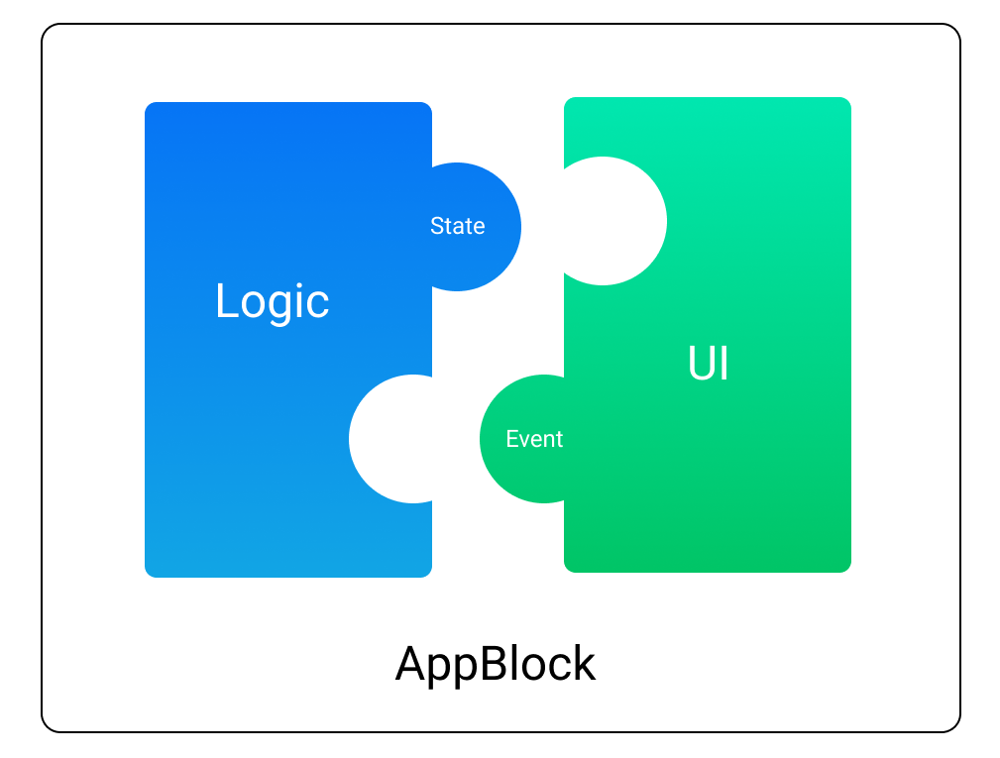

# Helium

Lightweight & approachable framework for Android. 100% Kotlin.


*What if building an App was as simple as assembling Lego blocks?*

## Download

[](https://search.maven.org/search?q=g:com.joaquimverges.helium) [](https://app.bitrise.io/app/9b5a174b9921d71f)
```groovy
implementation 'com.joaquimverges.helium:helium-core:x.y.z' // core classes
implementation 'com.joaquimverges.helium:helium-ui:x.y.z'   // ui components
implementation 'com.joaquimverges.helium:helium-navigation:x.y.z'   // navigation components

testImplementation 'com.joaquimverges.helium:helium-test:x.y.z'   // unit test helper classes
```

## An intuitive architecture pattern

Building an app should feel like assembling Lego blocks, that's the core principle of Helium. The framework proposes the following mental model to structure your code:

- `UiBlock`: a class that handles rendering UI.
- `LogicBlock`: a class that handles logic.
- `AppBlock = (LogicBlock + UiBlock)`: assembling logic with UI creates a fully functional piece of your App.  

Just like Lego blocks, or puzzle pieces, a `UiBlock` can only be assembled with a `LogicBlock` if they're compatible.

In code, this is handled by two classes representing the connectors between blocks: `BlockState` and `BlockEvent`

- a `LogicBlock` exposes (emits) a `BlockState` and expects (handles) a `BlockEvent`
- a `UiBlock` exposes (emits) a `BlockEvent` and expects (renders) a `BlockState`

If both Logic and UI expose and expect the same type of state and event, then they're compatible.



## Show me the code

Let's build a simple counter app. Here's what a the Activity would look like using Helium:

```kotlin
class CounterActivity : AppCompatActivity() {
    override fun onCreate(savedInstanceState: Bundle?) {
        super.onCreate(savedInstanceState)
        val logic = CounterLogic() // create a logic block
        val ui = CounterUi(layoutInflater) // create a UI block
        setContentView(ui.view)
        (logic + ui).assemble() // assemble them
    }
}
```

For a counter app, our state and event would be:

```kotlin
data class CounterState(val count: Int): BlockState
object TapEvent : BlockEvent
```

The logic block can be defined like this:

```kotlin
class CounterLogic : LogicBlock<CounterState, TapEvent>() {
    private var count = 0

    init {
        pushState(CounterState(0))
    }

    override fun onUiEvent(event: TapEvent) {
        pushState(CounterState(++count))
    }
}
```

And the UI block would look like this:

```kotlin
class CounterUi(inflater: LayoutInflater) : UiBlock<CounterState, TapEvent>(R.layout.counter_view, inflater) {
    private val counterButton = findView<TextView>(R.id.count_button)

    init {
        counterButton.setOnClickListener { pushEvent(TapEvent) }       
    }    

    override fun render(state: CounterState) {
        counterButton.text = state.count
    }
}
```

and that's all you need! You know have a functional counter, with clean separation of concerns and no boilerplate.

For detailed information and more advanced examples, head over to the [helium-core](/helium-core) documentation.

## Ready to use App Blocks

Helium provides the framework to build your own AppBlocks, but also provides a growing catalog of existing blocks ready to be used:

- [helium-ui](/helium-ui): List, Cards, ViewPager, etc.
- [helium-navigation](/helium-navigation): Toolbar, Bottom Navigation, Drawer, etc.  

Here's a typical usage of `ListUi`, one of the most useful blocks provided.

```kotlin
val listUi = ListUi(layoutInflater, { inflater, container ->
    MyListItem(inflater, container)
})
(MyListLogic() + listUi).assemble()
```

Follow the links above for documentation and examples on how to use those handy App Blocks in your own apps.

## Samples

- [newsapp](/samples/newsapp) - Fully functional News app downloadable on [Google Play](https://play.google.com/store/apps/details?id=com.jv.news)
- [demoapp](/samples/demoapp) - A catalog of different AppBlocks usages

## Testing

Unit testing blocks is easy, and you should always write tests for your `LogicBlock` when possible. Helium provides helper classes to make testing your logic super simple. Head over to the [helium-test](/helium-test) documentation to learn more.

## License

```
Copyright (C) 2020 Joaquim Verges

Licensed under the Apache License, Version 2.0 (the "License");
you may not use this file except in compliance with the License.
You may obtain a copy of the License at

   http://www.apache.org/licenses/LICENSE-2.0

Unless required by applicable law or agreed to in writing, software
distributed under the License is distributed on an "AS IS" BASIS,
WITHOUT WARRANTIES OR CONDITIONS OF ANY KIND, either express or implied.
See the License for the specific language governing permissions and
limitations under the License.
```
